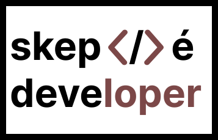

  

  
  
   
  

🚀 Software Engineer | 🌐 [Portfolio](https://your-portfolio-website.com) | [LINKEDIN](https://www.linkedin.com/in/fianu-stephen-7a880319a/")

## About Me

I'm a passionate software engineer with expertise in :

## Expertise

- **Full-Stack Development:** I specialize in both frontend and backend development, creating seamless user experiences while ensuring robust and scalable server-side functionality.

- **Technologies I Love:** My toolkit includes languages like Java, Typescript, Go and Python. I'm well-versed in frontend frameworks such as Angular and Vue, and I enjoy working with Springboot, and Nestjs for backend development.

- **Problem Solver:** I thrive on solving complex problems. Whether it's optimizing algorithms, architecting efficient systems, or troubleshooting bugs, I'm always up for a challenge.

- **Continuous Learner:** In the ever-evolving landscape of technology, I believe in the importance of continuous learning. Staying updated with the latest trends and tools is a key part of my professional journey.
  
- ⚡ Fun fact: I love singing...

## Skills

- Programming Languages: Java, Typescript, Go, Python
- Frontend: Agular, Vue
- Backend: Nestjs, Springboot
  
### :technologist: Tools :

  &nbsp;
  &nbsp;
  &nbsp;
  &nbsp;
  &nbsp;
  &nbsp;
  &nbsp;
  &nbsp;
  

  

  

---
### :writing_hand: Blog Posts :
coming soon...

